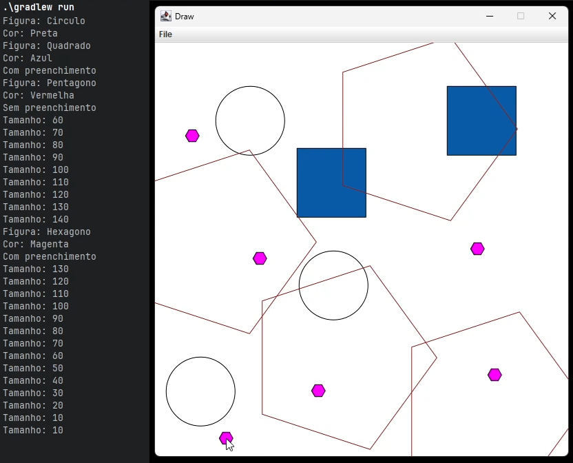

# Lista 4: Aplicativo de desenho vetorial

## Engenharia de Telecomunicações - Programação Orientada a Objetos
## Prof. Sergio Prolo - sergio.prolo@ifsc.edu.br
### 21 de junho de 2025
---
## (i) Informações iniciais

- A implementação das soluções deve seguir os princípios da Programação Orientada a Objetos, com
especial atenção à identificação correta de classes, atributos, métodos, associações (agregação, composição, dependência) e herança.
- O repositório fornecido contém um projeto Gradle exemplo. Utilize esse projeto para detalhar a sua solução para o problema proposto.
- Utilize o Git de forma adequada: commits frequentes, README.md informativo e .gitignore funcional. Lembrando que esse projeto depende da biblioteca algs4, portanto garanta que o seu .gitignore não ignore o arquivo.
- Organize seus códigos-fonte em pacotes temáticos para fazer bom uso dos membros protegidos.
- Para um exemplo de como capturar eventos do mouse e teclado usando a interface DrawListener, veja esse [repositório](https://github.com/poo29004/demo-evento-mouse).
- A avaliação considerará critérios de legibilidade, clareza e organização do código.

---
## Descrição
A aplicação a ser desenvolvida deve permitir o usuário desenhar diversas formas geométricas na tela do computador através do uso do mouse e teclado. Você pode (e deve) se inspirar nos exercícios realizados em sala sobre o tema, apresentados nos slides de herança/polimorfismo. O objetivo dessa lista é utilizar de forma efetiva o polimorfismo para imprimir e mover diversas figuras na tela, bem como processar valores a partir delas. A Figura 1 apresenta uma captura de tela realizada durante a execução do programa. Esse documento também é acompanhado de um vídeo que mostra uma operação comum com a aplicação.

## Requisitos técnicos
- O terminal deve ser usado apenas para impressão e nunca para leitura.
- Apenas a classe da aplicação principal (App) deve interagir com o terminal.
- A classe Draw e a interface DrawListener da biblioteca algs4 devem ser usadas para implementar o comportamento da aplicação.
- Ao menos uma nova interface e uma nova classe abstrata devem ser criadas e usadas na implementação da sua aplicação.
- Onde você fazer uso do polimorfismo, deve haver um comentário indicando seu uso (por exemplo, “// aqui eu uso polimorfismo”)

## Requisitos funcionais
- **Impressão de figuras com o mouse**: Quando o usuário clicar com o mouse, uma nova figura deve ser impressa na imagem. Sua posição deve ser centralizada no local apontado pelo usuário.

_Figura 1: Captura de tela durante execução da aplicação de desenho vetorial_

- **Controle da aplicação pelo teclado**: Quando o usuário pressionar teclas no teclado, a aplicação deve atualizar suas configurações e parâmetros internos para alterar o comportamento de impressão ou informar o usuário de valores calculados. Toda alteração realizada dessa forma deve ser informada no terminal, para que o usuário tenha uma confirmação da sua escolha. Os controles que devem ser implementados são:
    1. **Seleção de figura**: Usando as teclas F1-F4, o usuário pode selecionar qual figura geométrica ele quer imprimir. Você deve disponibilizar quatro figuras, uma para cada tecla. Escolha dentre as seguintes formas regulares: círculo; losango; quadrado; trapézio; pentágono; e hexágono.
    2. **Seleção de cor**: Usando as teclas F5-F8, o usuário pode selecionar qual cor será usada para imprimir a figura. Você deve disponibilizar quatro cores, uma para cada tecla. Escolha cores de alto contraste com o fundo da tela.
    3. **Seleção de modo**: Usando a tecla ‘F’, o usuário pode alternar entre impressão vazada ou preenchida. Caso vazada, a cor da borda deve ser a cor selecionada pelo usuário. Caso preenchida, a cor da borda deve ser preta.
    4. **Seleção de tamanho**: Usando as teclas ‘Q’ e ‘W’, o usuário pode diminuir e aumentar o tamanho da figura a ser impressa, respectivamente. Você deve limitar o tamanho de impressão a valores mínimo e máximo, evitando a não visualização da impressão.
    5. **Movimento**: Usando as setas do teclado, o usuário pode mover todas as figuras desenhadas nas quatro direções cardinais.
    6. **Limpeza**: Usando a tecla ‘C’, o usuário pode limpar todos os desenhos da tela.
    7. **Processar**: Usando a tecla ‘P’, o usuário pode receber as seguintes informações sobre as figuras atualmente impressas na tela através do terminal: número total, soma perímetros e área média.